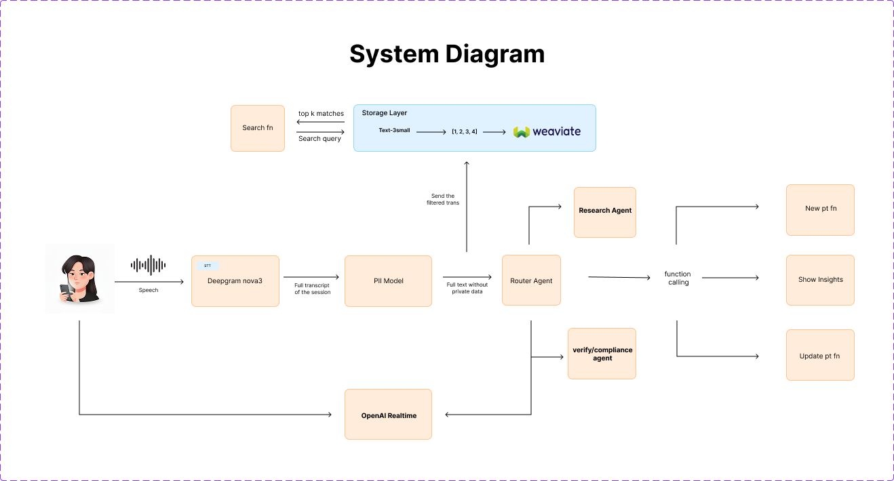

# HealthSync

HealthSync is a modern, AI-powered application that provides audio recording and transcription capabilities across mobile and web platforms. The project is built using React Native for mobile and Next.js for the web, with a focus on performance, accessibility, and developer experience.

## 🤝 Sponsors

We're grateful to our sponsors for their support in making HealthSync possible:

- [OpenAI](https://openai.com) - For their powerful AI models that drive our transcription and natural language understanding
- [Lovable](https://lovable.dev) - For their design system and UI components that helped shape our user experience
- [Weaviate](https://weaviate.io) - For their vector search technology that enables intelligent document retrieval and analysis


## 🚀 Features

- **Cross-platform Support**: Mobile (iOS/Android) and Web applications
- **Audio Recording**: High-quality audio capture with real-time processing
- **AI-Powered Transcription**: Powered by Deepgram for accurate speech-to-text
- **Modern UI**: Built with Tailwind CSS and Radix UI components
- **Type Safety**: Full TypeScript support throughout the codebase
- **Responsive Design**: Optimized for all device sizes

## 🏗️ Project Structure

```
serona/
├── mobile/           # React Native mobile application
│   ├── assets/       # Static assets (images, fonts, etc.)
│   ├── components/   # Reusable UI components
│   ├── services/     # API and service integrations
│   └── App.tsx       # Main application component
├── web/              # Next.js web application
│   ├── app/          # Next.js app directory
│   ├── components/   # Reusable UI components
│   ├── lib/          # Utility functions and configurations
│   └── public/       # Static files
└── README.md         # This file
```

## 🛠️ Prerequisites

- Node.js 18.0.0 or later
- npm 9.0.0 or later / Yarn 1.22.0 or later
- For mobile development:
  - Xcode 14+ (for iOS development)
  - Android Studio (for Android development)
  - Expo CLI (`npm install -g expo-cli`)

## 🚀 Getting Started

### Mobile App

1. **Clone the repository**
   ```bash
   git clone https://github.com/your-username/serona.git
   cd serona/mobile
   ```

2. **Install dependencies**
   ```bash
   npm install
   # or
   yarn
   ```

3. **Set up environment variables**
   Create a `.env` file in the `mobile` directory with the following variables:
   ```env
   DEEPGRAM_API_KEY=your_deepgram_api_key
   ```

4. **Start the development server**
   ```bash
   npm start
   # or
   yarn start
   ```

5. **Run on device/emulator**
   - For iOS: Press `i` in the terminal or scan the QR code with your iOS device
   - For Android: Press `a` in the terminal or scan the QR code with your Android device

### Web App

1. **Navigate to the web directory**
   ```bash
   cd ../web
   ```

2. **Install dependencies**
   ```bash
   npm install
   # or
   yarn
   ```

3. **Set up environment variables**
   Create a `.env.local` file in the `web` directory:
   ```env
   NEXT_PUBLIC_SUPABASE_URL=your_supabase_url
   NEXT_PUBLIC_SUPABASE_ANON_KEY=your_supabase_anon_key
   ```

4. **Start the development server**
   ```bash
   npm run dev
   # or
   yarn dev
   ```

5. **Open in browser**
   Visit `http://localhost:3000` in your browser

## 🧩 Key Technologies

### Mobile
- **React Native** - Cross-platform mobile development
- **Expo** - Development platform for React Native
- **NativeWind** - Utility-first CSS framework for React Native
- **Expo AV** - Audio/Video playback and recording
- **Deepgram** - Speech-to-text transcription

### Web
- **Next.js** - React framework for server-rendered applications
- **Tailwind CSS** - Utility-first CSS framework
- **Radix UI** - Unstyled, accessible UI components
- **shadcn/ui** - Re-usable components built using Radix UI
- **Supabase** - Backend as a Service

## 📚 API Documentation

### Audio Recording
- **Start Recording**
  ```javascript
  const { startRecording } = useAudioRecorder();
  await startRecording();
  ```

- **Stop Recording**
  ```javascript
  const { stopRecording } = useAudioRecorder();
  const audioFile = await stopRecording();
  ```

### Transcription
- **Transcribe Audio**
  ```javascript
  import { transcribeAudio } from '@/services/transcription';
  
  const transcription = await transcribeAudio(audioFile);
  ```

## 📊 System Architecture



## 🤝 Contributing

1. Fork the repository
2. Create your feature branch (`git checkout -b feature/AmazingFeature`)
3. Commit your changes (`git commit -m 'Add some AmazingFeature'`)
4. Push to the branch (`git push origin feature/AmazingFeature`)
5. Open a Pull Request


## 📄 License

This project is licensed under the MIT License - see the [LICENSE](LICENSE) file for details.

## 🙏 Acknowledgments

- [Expo](https://expo.dev/) for the amazing React Native development experience
- [Deepgram](https://deepgram.com/) for the speech-to-text API
- [shadcn/ui](https://ui.shadcn.com/) for the beautiful components
- [Tailwind CSS](https://tailwindcss.com/) for the utility-first CSS framework
